# HospitalApp
<h3>Demo run of The Project - </h3>

<h1 [align]="center">Home Page</h1>
    
    
    
    <h1 [align]="center">Patien Registration Page Page</h1>

    <h1 [align]="center">Patient Login Page</h1>
    
    <h1 [align]="center">Book Appointment Page</h1>
    
    
    <h1 [align]="center">Patient Dashboard</h1>
     
    <h1 [align]="center">Patient Dashboard appointment Deatils</h1>
    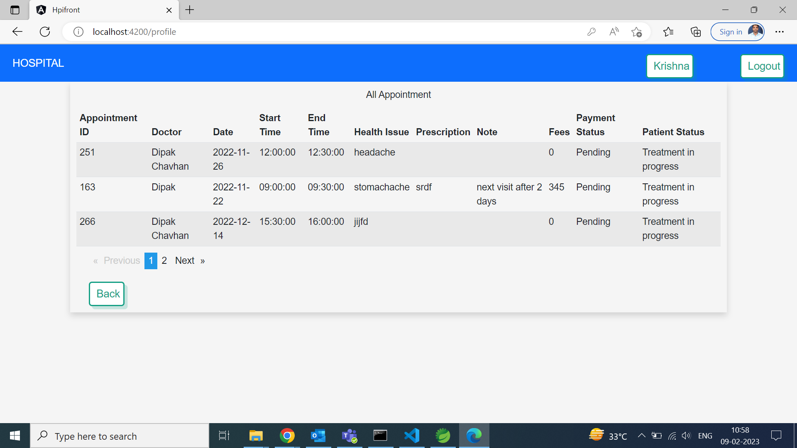 
     
    <h1 [align]="center">Doctor Registration page</h1>
    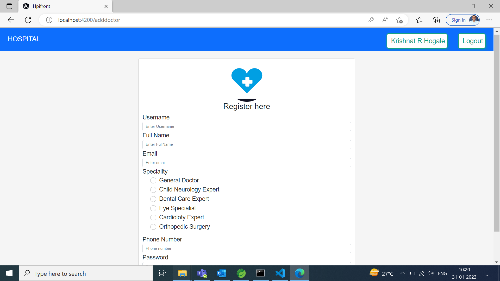 
    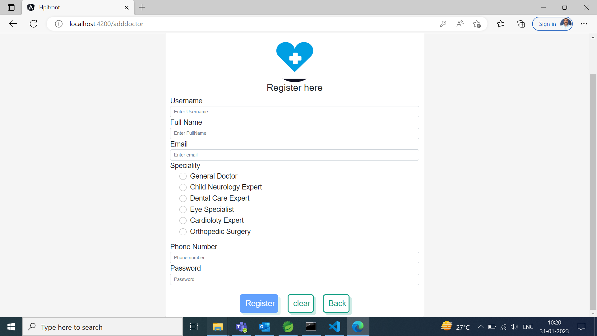 
    <h1 [align]="center">Doctor Dashboard</h1>
    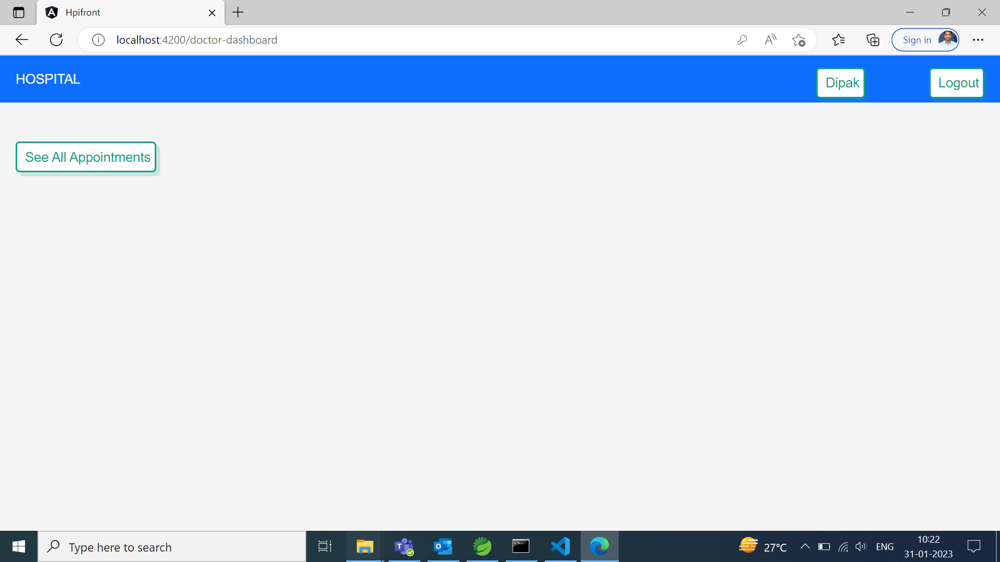 
    <h1 [align]="center">Appontment list for doctor</h1>
    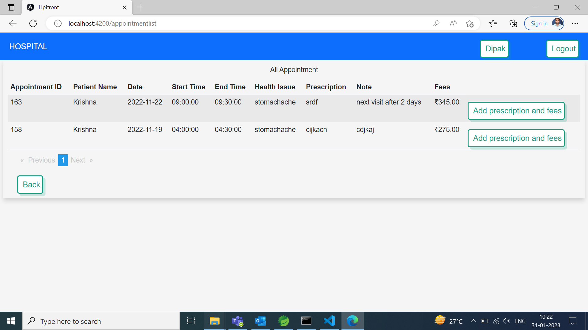 
    <h1 [align]="center">Adding Prescription Page</h1>
    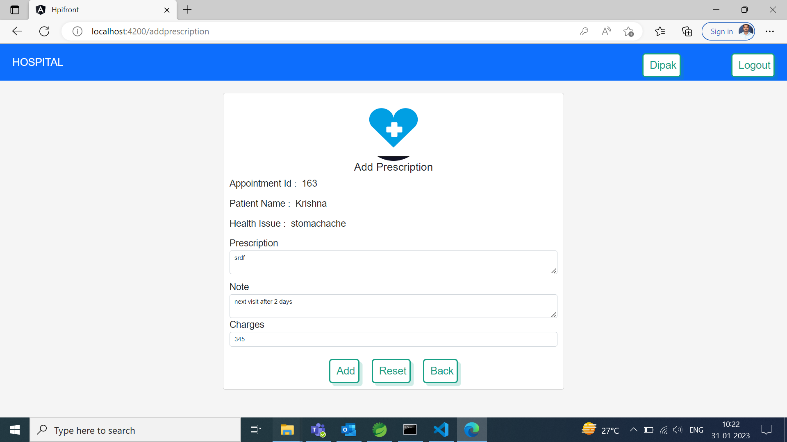 
    <h1 [align]="center">Admin Dashboard</h1>
    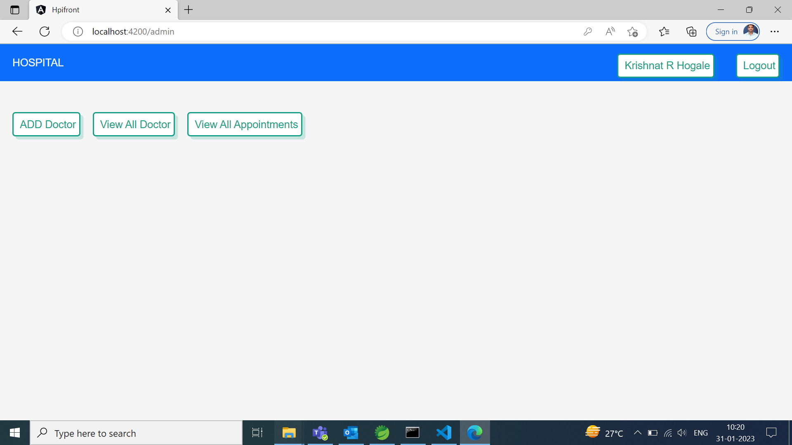 
    <h1 [align]="center">Usre list for Admin</h1>
    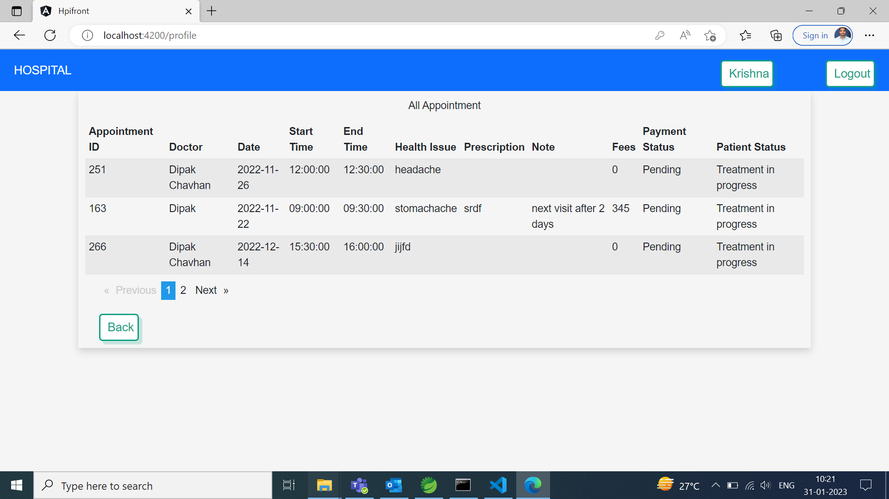 
    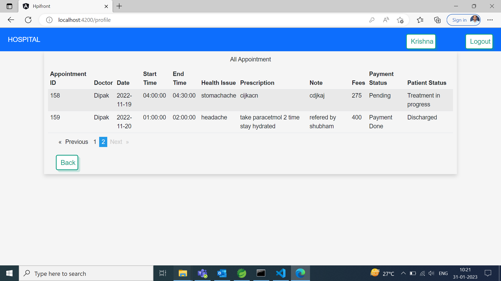 
    <h1 [align]="center">Doctor list for Admin</h1>
     
    <h1 [align]="center">All Appointment List  for Admin</h1>
    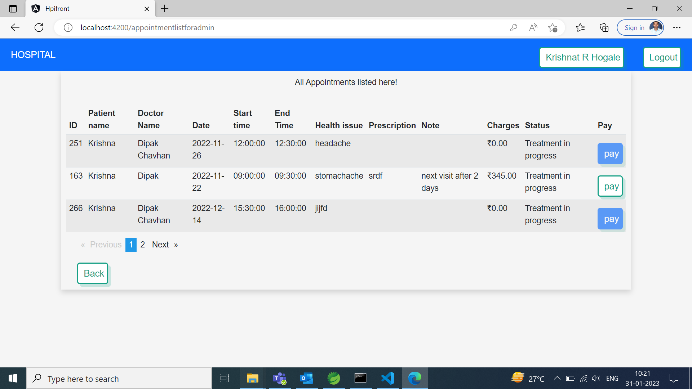 
    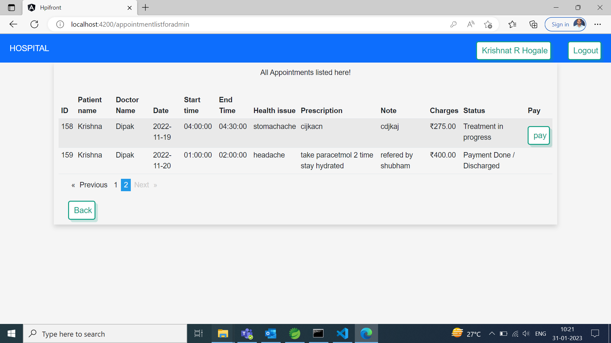 

    

    

    

