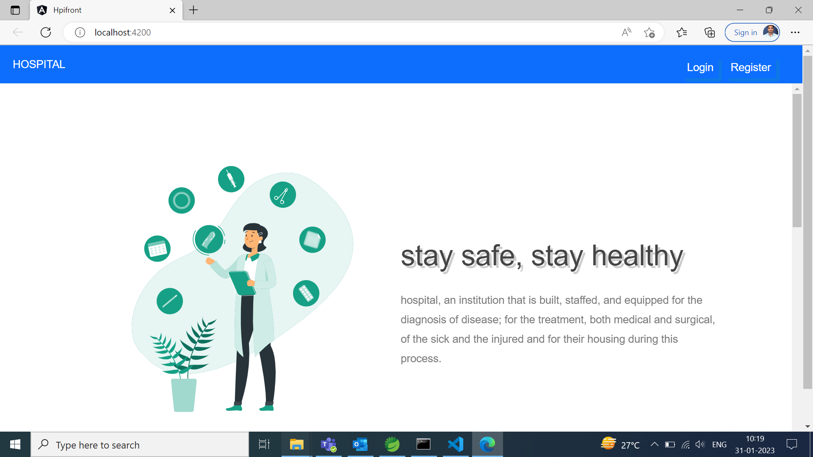
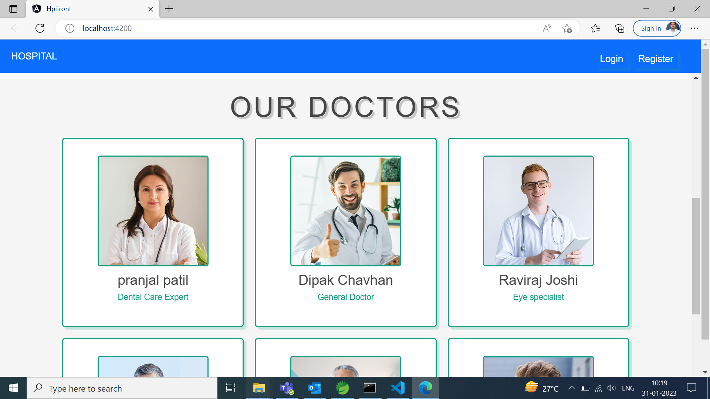
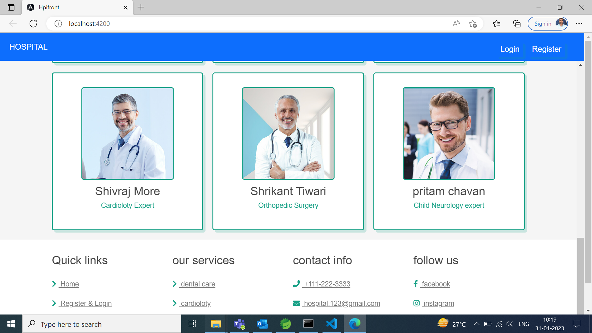
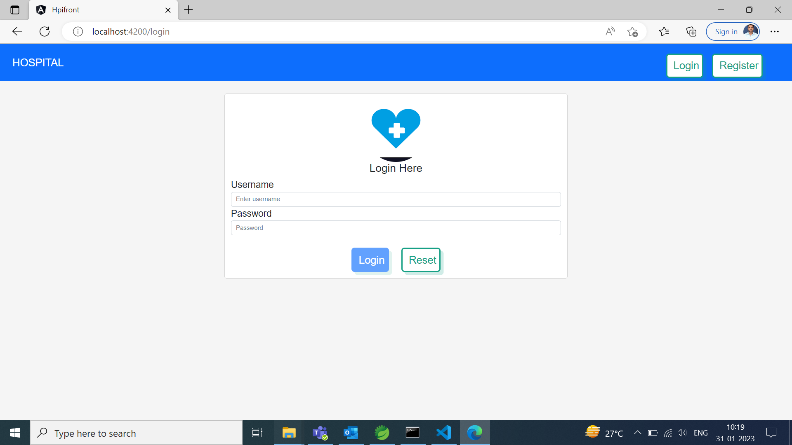
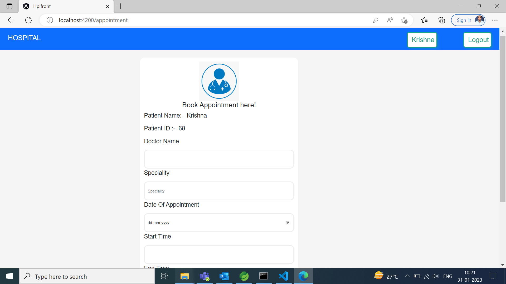
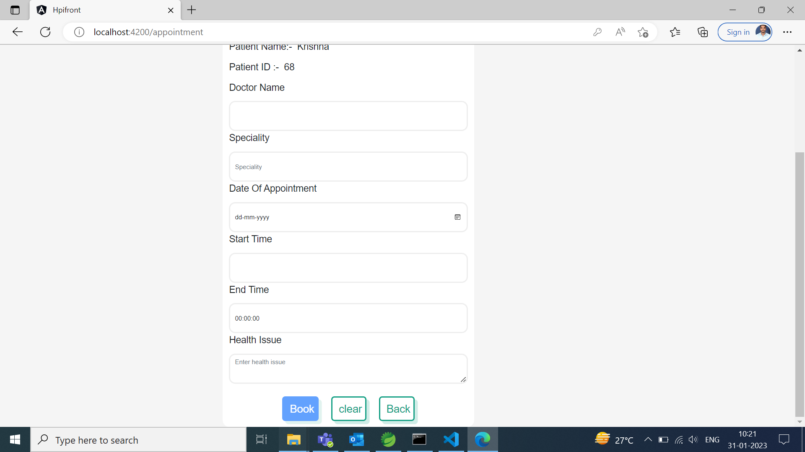
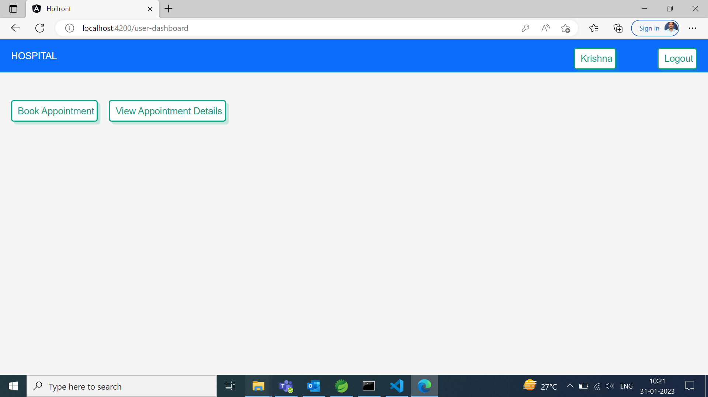

# HospitalApp
<h3>Demo run of The Project - </h3>

<h1 [align]="center">Home Page</h1>
    
    
    
    <h1 [align]="center">Patien Registration Page Page</h1>

    <h1 [align]="center">Patient Login Page</h1>
    
    <h1 [align]="center">Book Appointment Page</h1>
    
    
    <h1 [align]="center">Patient Dashboard</h1>
    

    

